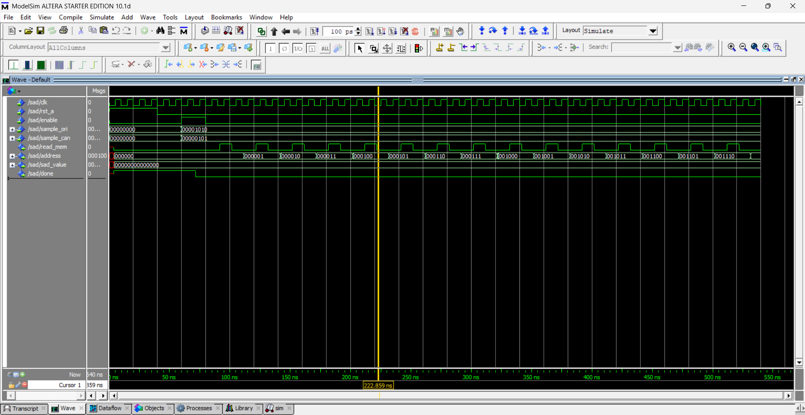

# Atividade Prática 2

Este relatório apresenta o desenvolvimento e a implementação de um circuito digital para o cálculo da Soma das Diferenças Absolutas (SAD) utilizando VHDL, abordando sua estrutura modular, funcionamento e validação por simulação.

## Dupla 5

- Daniel Garcia Boer (25105144)
- Filipe Potrich Cechim (25100483)

## Descrição

O circuito desenvolvido implementa o cálculo da **Soma das Diferenças Absolutas (SAD – _Sum of Absolute Differences_)**, operação amplamente utilizada em sistemas de **processamento digital de sinais** e **visão computacional**, especialmente em algoritmos de **correlação de blocos** e **compressão de vídeo**.

O objetivo do circuito é calcular a soma das diferenças absolutas entre dois conjuntos de valores (por exemplo, intensidades de pixels em blocos de imagem), de forma **modular e síncrona**, utilizando componentes básicos projetados em **VHDL**.

---

### Estrutura

O cálculo da SAD é descrito por

$$
SAD = \sum_i |A_i - B_i|
$$

O sistema foi dividido em módulos independentes, facilitando o entendimento, a simulação e a reutilização dos componentes.  
Os principais blocos que compõem o projeto e as seções de código mais representativas de suas funções são:

- `absolute_difference.vhdl` — responsável por calcular o valor absoluto da diferença entre dois sinais -> cálculo representado principalmente pela descrição a seguir;

```vhdl
ARCHITECTURE structure OF absolute_difference IS
--- ... declarações de sinais com tamanhos genéricos
BEGIN
    -- Calcula as duas direcoes da subtracao concorrentemente
    diff_a_minus_b <= input_a - input_b; -- (A - B)
    diff_b_minus_a <= input_b - input_a; -- (B - A)

    -- O sinal de selecao escolhe o resultado positivo (nao-overflow)
    -- '1' seleciona (A - B) se A >= B
    -- '0' seleciona (B - A) se A < B
    select_mux <= '1' when input_a >= input_b else '0';
--- ... (instância do mux e output da diferença absoluta)
END structure;
```

- `signed_subtractor.vhdl` — realiza a subtração entre números com sinal -> aqui, destaca-se a subtração entre números com sinal, ou seja, do tipo signed, a qual é diferenciada da anterior por esse único motivo;
- `unsigned_adder.vhdl` — efetua a soma de valores inteiros sem sinal -> utilizado no bloco operativo da SAD (sad_bo) para mapear os valores retornados da diferença absoluta para suas entradas de soma, compreendendo a soma iterativa das diferenças como explicitado pela seguinte expressão e código:

$ \sum\_{i=0}^{N-1} |A_i - B_i| $

```vhdl
    calc_abs_diff : entity work.absolute_difference
        generic map(N => CFG.bits_per_sample)
        port map(input_a => a_reg_q, input_b => b_reg_q, abs_diff => abs_diff_out);

    -- UNIDADE ACUMULADORA (Soma)
    soma_in_b <= resize(abs_diff_out, SAD_WIDTH); -- Ajusta largura do resultado

    adder_soma : entity work.unsigned_adder
        generic map(N => SAD_WIDTH)
        port map(input_a => soma_q, input_b => soma_in_b, sum => soma_sum);
```

- `mux_2to1.vhdl` — seleciona entre duas entradas com base em um sinal de controle -> usado por absolute_difference para selecionar o resultado positivo de uma das duas subtrações feitas (seção do código apresentada anteriormente em absolute_difference);
- `unsigned_register.vhdl` — armazena valores intermediários de forma síncrona com o clock -> utilizado em sad_bo e gerenciado, assim, pelos sinais de comando vindos do bloco de controle sad_bc;
- `sad_pack.vhdl` — contém tipos e constantes auxiliares utilizados nos módulos principais. Um exemplo a seguir é a declaração da função sad_length em sad_pack, que é utilizada posteriormente em sad_bo (seção de código mostrada após a primeira);

```vhdl
--- sad_pack
    function sad_length(bits_per_sample : positive; samples_per_block : positive) return positive;
```

--

```vhdl
--- sad_bo
    constant SAD_WIDTH  : positive := sad_length(CFG.bits_per_sample, CFG.samples_per_block);
```

- `sad_bc.vhdl` e `sad_bo.vhdl` — blocos intermediários de controle e operação do SAD, responsáveis pela organização das entradas e pela soma acumulada;
- `sad.vhdl` — módulo principal, que integra os componentes anteriores e implementa a lógica completa da soma das diferenças absolutas. É similar a uma interface em que os blocos são instanciados e recebem as variáveis antes centralizadas na sad.

### Simulação

A validação funcional e a depuração da arquitetura SAD v1 foram realizadas primariamente durante a Atividade Prática 1 (AP1), utilizando o ambiente de testes e simulação do **VPL**. Os testes no VPL cobriram diversos casos de uso e combinações de entrada, confirmando que a lógica do circuito estava funcionalmente correta antes da etapa de síntese.

Para esta Atividade Prática 2 (AP2), após a síntese bem-sucedida do projeto no Quartus II, foi realizada uma simulação adicional do tipo **"Gate Level Simulation"**. Esta simulação foi executada utilizando a ferramenta **ModelSim-Altera**, iniciada a partir do próprio Quartus. Este método permite a inclusão dos atrasos reais de portas e interconexões calculados durante a síntese (utilizando o arquivo `.sdo` gerado).

Para esta simulação, foi criado um script de estímulos (`estimulos.do`) que reseta o circuito, aplica valores de entrada (`sample_ori` = 10 e `sample_can` = 5) e habilita o início do cálculo.

O resultado da simulação (imagem abaixo) confirma o comportamento esperado da máquina de estados síncrona:

- O circuito responde corretamente ao sinal de reset (`rst_a`).
- Após o `enable`, os sinais de saída `address` e `read_mem` mostram que o circuito está iterando automaticamente pelos endereços de memória para realizar o cálculo do SAD, validando a lógica de controle pós-síntese.



## Outras observações

Neste README foi feita uma descrição resumida do circuito SADv1, mas é possível acompanhar uma explicação mais detalhada por meio dos comentários presentes ao longo dos arquivos VHDL na pasta `rtl`.

Os resultados da análise de timing e de custo estão no arquivo `resultados.json`.
